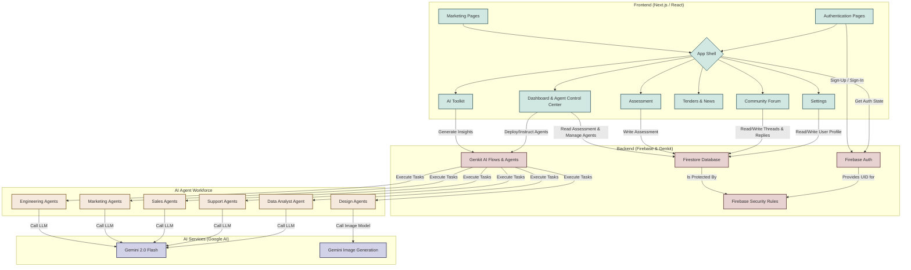

# Radbit SME Hub: System Architecture

This document provides a high-level overview of the Radbit SME Hub's system structure, components, and data flow.

---

## Component Breakdown

### **Frontend (Next.js)**

-   **`src/app`**: Contains all pages and layouts.
    -   **`Dashboard & Agent Control Center`**: The central hub for users to get an overview, manage their deployed AI agents, and view results.
    -   Other pages remain as they are, serving core functionalities like Assessment, Community, etc.

### **Backend & AI (Firebase & Genkit)**

-   **Firebase Auth & Firestore**: Continue to manage user identity, profiles, and application data.
-   **`src/ai/flows`**: Contains all Genkit AI flows. This layer is expanded to become the **AI Agent Orchestrator**. It defines the core logic for each type of agent (e.g., `codeGeneratorAgent`, `contentCreatorAgent`) and manages their execution. Each agent is a specialized flow that may use one or more tools or prompts to accomplish its task.
-   **AI Agent Workforce**: This is a conceptual layer representing the specialized AI agents. Each agent (e.g., `Engineering Agent`) is a collection of Genkit flows and tools designed for a specific business function. They are invoked by the orchestrator in response to user requests from the dashboard.
